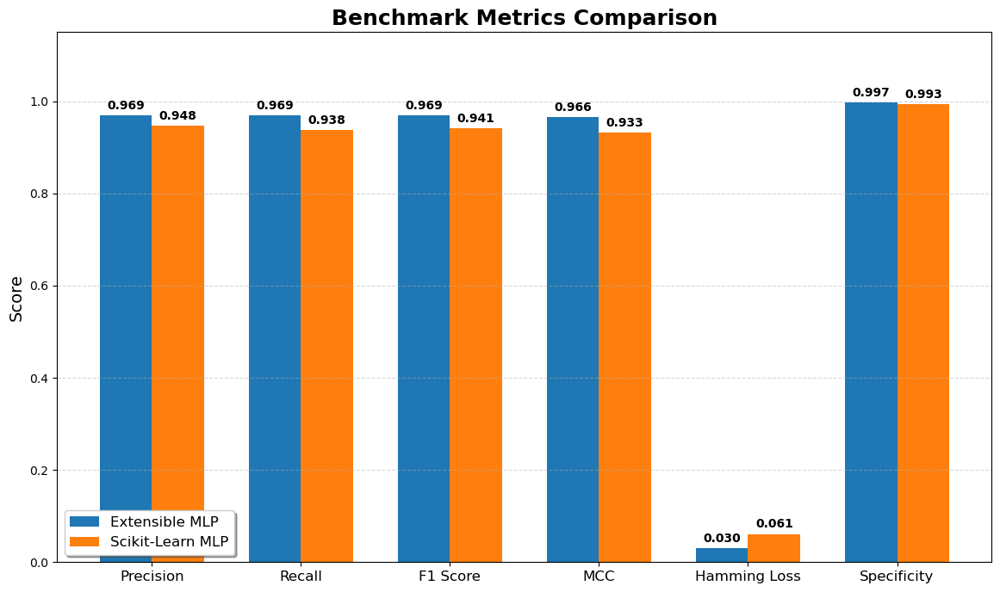
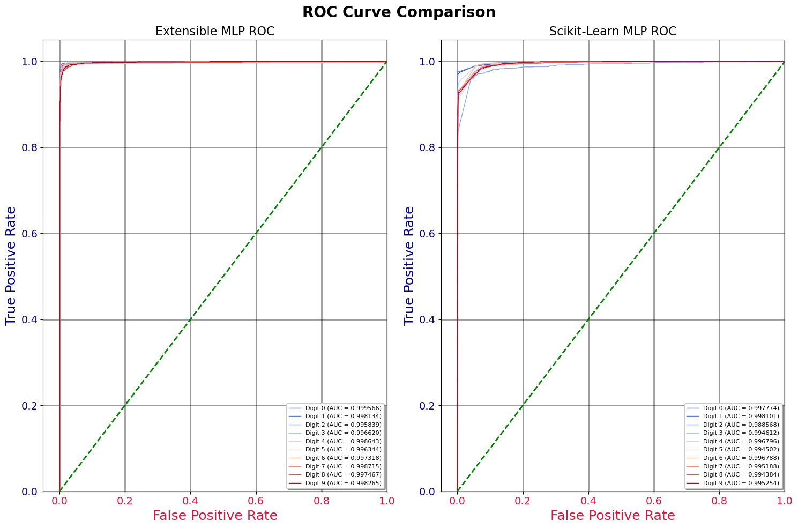
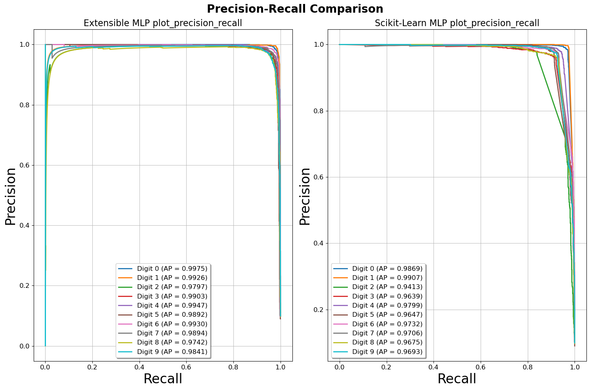
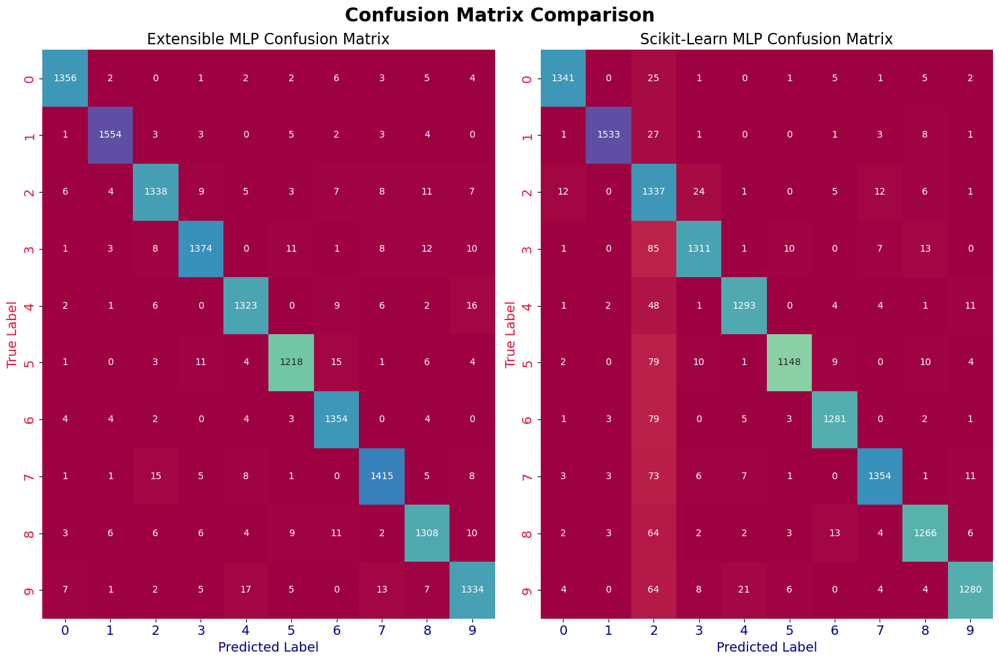

# Extensible MLP: A First Principles Deep Learning Framework

> "I didn't want to just call model.fit(). I wanted to own the logic." [**View The Code**](neural_net.py)

Extensible MLP is a GPU-accelerated, Scikit-Learn compatible neural network framework built entirely from scratch using CuPy. It was born out of a desire to peel back the "black box" of modern libraries and implement the complex math of backpropagation manually.

This isn't just a reimplementation of existing tools; it is a journal of understanding how neural networks actually work, from the matrix calculus up to production-level memory management.


## The Philosophy

This project started with a strict set of rules for myself:

1.  **No generic AI help:** I avoided asking LLMs to "write a neural net" for me. I wanted the struggle.
2.  **First principles:** If I couldn't derive the math (gradients, Jacobians) on paper, I wouldn't code it.
3.  **Analyze, don't guess:** When the loss stalled, I spent days analyzing *why* rather than blindly copy-pasting fixes.
4.  **Scale:** It had to work on real data (MNIST), which meant handling GPU memory and matrix efficiency properly.

## The "Triple BAM" Moment: Deriving the Math


The core breakthrough of this engine came when I was struggling to implement the backpropagation for different tasks. I was writing separate, complex derivatives for Regression (MSE) and Classification (Cross-Entropy).

I went back to the whiteboard and derived the gradients manually. I realized that for Generalized Linear Models (GLMs), if you pair the right activation function with the right loss function (the "Canonical Link"), the complex Jacobian matrix of the activation function cancels out perfectly with the derivative of the loss function.

The result was a unified, polymorphic gradient equation:

$$\\frac{\\partial L}{\\partial z} = \\hat{y} - y$$

* **Regression:** Identity activation + MSE loss.
* **Classification:** Softmax activation + Cross-Entropy loss.

In both cases, the gradient is simply the difference between the prediction and the target. This realization allowed me to write a single backpropagation engine that adapts to the task automatically.

## Engineering Highlights

### 1. The Polymorphic Architecture
Initially, I thought I needed separate classes for Regressor and Classifier. Realizing the math was identical allowed me to use a Strategy Pattern. The network reconfigures its final layer and loss function at runtime based on the target data.

I implemented this in [`_setup_task`](neural_net.py#L150), which inspects the target `y` and configures the engine dynamically:

```python
def _setup_task(self, y):
    if self.task == 'classification':
        self.classes_ = np.unique(y)
        # ... processing logic ...
        final_act = 'softmax'
        self._loss_func = self.multinomial_cross_entropy

    elif self.task == 'regression':
        # ... processing logic ...
        final_act = 'identity'
        self._loss_func = self.mean_squared_error
    
    return y_proc, final_act
```

### 2. Solving the Stalling Loss (Initialization)
Early in the project, my loss function would constantly stall at ~2.3. After days of debugging, I realized my weight initialization was ignoring the properties of my activation functions.

I implemented dynamic initialization strategies based on the papers by Glorot and He:
* **ReLU/Leaky ReLU:** Uses He Initialization.
* **Sigmoid/Tanh/Softmax:** Uses Xavier (Glorot) Initialization.

[View Code](neural_net.py#L312)
```python
# From _initialize_architecture
if self.activation == 'relu':
    # He Initialization (Variance = 2/n_in)
    std = cp.sqrt(2.0 / self.layer_sizes_[i])
else:
    # Xavier Initialization (Variance = 2/(n_in + n_out))
    std = cp.sqrt(2.0 / (self.layer_sizes_[i] + self.layer_sizes_[i+1]))
    
w = rgen.normal(0.0, scale=std, size=(n_in, n_out))
```

### 3. GPU Memory Management ("Scar Tissue")
Moving from toy datasets to MNIST on a GPU introduced immediate crashes (OOM errors). I had to implement "scar tissue" logic; code written specifically to handle the reality of hardware limits.

In [`predict_proba`](neural_net.py#L272), I enforce a hard cleanup after every batch to ensure VRAM never leaks, allowing the model to inference on datasets infinitely larger than the GPU memory.

```python
for l in range(0, n_samples, self.batch_size):
    # ... forward pass ...
    batch_probs = cp.asnumpy(acts[-1]) # Move to CPU immediately
    results.append(batch_probs)
    
    # Explicit cleanup to prevent VRAM accumulation
    del X_batch
    del acts
    cp.get_default_memory_pool().free_all_blocks()
```

### 4. Scikit-Learn Integration
To make the tool usable in real workflows, I implemented the full Scikit-Learn API. I used Python's `inspect` module to dynamically fetch parameters from the parent class, allowing `GridSearchCV` and `Pipeline` to "see" my custom hyperparameters without writing redundant boilerplate code in every child class.

[View Code](neural_net.py#L45)
```python
def get_params(self, deep=True):
    ch_params = super().get_params(deep)
    base_sig = inspect.signature(BaseNeuralNet.__init__)

    for name, param in base_sig.parameters.items():
        if name == 'self' or param.kind == param.VAR_KEYWORD: continue
        if hasattr(self, name):
            ch_params[name] = getattr(self, name)
    return ch_params
```

## Features

* **GPU-Accelerated Core:** Built entirely on **CuPy**, replacing standard NumPy operations with CUDA-backed kernels. This allows for massive matrix multiplications that are orders of magnitude faster than CPU-based "from scratch" implementations.
* **Polymorphic Backpropagation:** Implements a unified gradient engine based on the **Canonical Link** theory. By mathematically aligning activation functions with their corresponding loss functions, the backward pass simplifies to a single, shared equation ($\hat{y} - y$) for both Regression and Classification tasks.
* **Dynamic Initialization Strategy:** Automatically selects the optimal weight initialization based on the layer's activation function.
    * **ReLU/Leaky ReLU:** Uses **He Initialization** to prevent dying gradients.
    * **Sigmoid/Tanh:** Uses **Xavier (Glorot) Initialization** to maintain variance across layers.
* **Production-Grade Memory Safety:** Implements "scar tissue" logic for VRAM management. The `predict_proba` method includes explicit garbage collection hooks (`cp.get_default_memory_pool().free_all_blocks()`) and automatic batching, allowing inference on datasets larger than available GPU memory without OOM crashes.
* **Scikit-Learn Native:** A true drop-in replacement for `sklearn` estimators.
    * Inherits from `BaseEstimator` and `ClassifierMixin`.
    * Uses Python's `inspect` module to dynamically map custom hyperparameters to the parent class, enabling full compatibility with **GridSearchCV** and **Pipelines**.
* **Zero-Copy Metrics Bridge:** Calculates score metrics (F1, Precision, Recall) directly on the GPU tensors, avoiding costly Device-to-Host (GPU $\to$ CPU) synchronization stalls during training loops.
* **Robust Convergence Controls:** Not just a toy model; includes essential engineering controls for training on real-world loss landscapes:
    * **Gradient Clipping:** Prevents exploding gradients in deep networks.
    * **Learning Rate Decay:** Anneals the learning rate over time for finer convergence.
    * **Early Stopping:** Monitors validation loss to prevent overfitting.
      
## The Pipeline
To ensure robust training on the MNIST dataset, the [`MNIST.ipynb`](https://github.com/Booma1002/ML-Classes/blob/main/MNIST.ipynb) notebook implements a standard preprocessing pipeline before feeding data into the neural network:
1.  **Scaling:** A `StandardScaler` is used to normalize pixel values (0-255) to a standard normal distribution (mean=0, var=1). This prevents gradient explosion and helps the optimizer converge faster.
2.  **Dimensionality Reduction:** `PCA` (Principal Component Analysis) is applied to compress the 784 input features down to 300 components. This retains >95% of the variance while significantly reducing the computational load on the matrix multiplication engine.
3.  **Model:** The processed features are fed into the `NeuralNetwork` class, which uses the "He" initialization strategy for the selected ReLU activation function.


## Empirical Analysis & Benchmarking
To validate the "First Principles" implementation, I benchmarked **Extensible MLP** against the industry-standard **Scikit-Learn `MLPClassifier`** on the MNIST dataset (10k test samples).
### Statistical Significance (McNemar's Test)
I used **McNemar’s Test** to rigorously compare the predictive models. Unlike simple accuracy comparisons, McNemar's test focuses on the *disagreement* between two classifiers to determine if they make errors in significantly different ways.

### Statistical Significance (McNemar's Test)
I used **McNemar’s Test** to rigorously compare the predictive models. Unlike simple accuracy comparisons, McNemar's test focuses on the *disagreement* between two classifiers to determine if they make errors in significantly different ways.

| Metric | Result | Conclusion |
| :--- | :--- | :--- |
| **Chi-squared** | 249.3780 | - |
| **p-value** | **0.0000** | **Significant Difference** |
| **Head-to-Head** | **+430 Cases** | **Extensible MLP Wins** |

**Interpretation:** The test rejected the null hypothesis ($p < 0.05$), confirming the models are statistically distinct. Crucially, in a head-to-head analysis of disjoint errors (cases where one model was right and the other wrong), **Extensible MLP correctly classified 430 more images than Scikit-Learn.** This suggests the custom CuPy-backed optimizer and dynamic initialization strategy successfully converged on a superior local minimum.

### Metrics Comparison - [View Plotting Logic](visualization.py#L225)
Despite the statistical divergence, the custom implementation remains highly competitive across all key classification metrics.


### Visual Comparisons
All visualization logic is decoupled into a separate module: [`visualization.py`](visualization.py).
#### 1. ROC Curves (Class Separation) - [View Plotting Logic](visualization.py#L153)
Both models exhibit near-perfect Area Under Curve (AUC) for all digits, confirming that the custom gradient descent optimizer effectively separated the latent space.



#### 2. Precision-Recall Curves - [View Plotting Logic](visualization.py#L190)
The Precision-Recall curves confirm that the model maintains high precision even as recall increases, showing that the custom implementation is not trading off false positives for coverage.



#### 3. Confusion Matrices - [View Plotting Logic](visualization.py#L111)
Visual inspection shows that while the models are statistically distinguishable, they struggle with similar edge cases (e.g., distinguishing "4" from "9").



* **Observation:** The breakdown reveals that while errors are symmetric in type, the custom implementation achieves a slightly higher True Positive rate on average, contributing to the +430 net win in the head-to-head comparison.


## References & Inspiration

My journey was guided by these core resources, which I studied to understand the "why" behind the code:

1.  **Sebastian Raschka's Lecture Notes:** [Specifically L8 on Logistic Regression & Softmax.](https://sebastianraschka.com/pdf/lecture-notes/stat453ss21/L08_logistic__slides.pdf)
2.  **Xavier Glorot & Yoshua Bengio (2010):** ["Understanding the difficulty of training deep feedforward neural networks."](https://proceedings.mlr.press/v9/glorot10a/glorot10a.pdf)
3.  **3Blue1Brown:** [Neural Networks intuitive illustration.](https://youtube.com/playlist?list=PLZHQObOWTQDNU6R1_67000Dx_ZCJB-3pi&si=TSHHNefSiJ-UNxCD)
4.  **Scikit-learn's API Reference:** For [`ClassifierMixin`](https://scikit-learn.org/stable/modules/generated/sklearn.base.ClassifierMixin.html) And [`BaseEstimator`](https://scikit-learn.org/stable/modules/generated/sklearn.base.BaseEstimator.html) Classes.
5.  **CuPy's User Guide:** [Basics of cupy.ndarray.](https://docs.cupy.dev/en/stable/user_guide/basic.html)
6.  **Sebastian Raschka (2018):** ["Model Evaluation, Model Selection, and Algorithm Selection in Machine Learning"](https://arxiv.org/abs/1811.12808); Used as the basis for the statistical benchmarking methods (McNemar's Test) and validation strategies implemented in the notebook.
